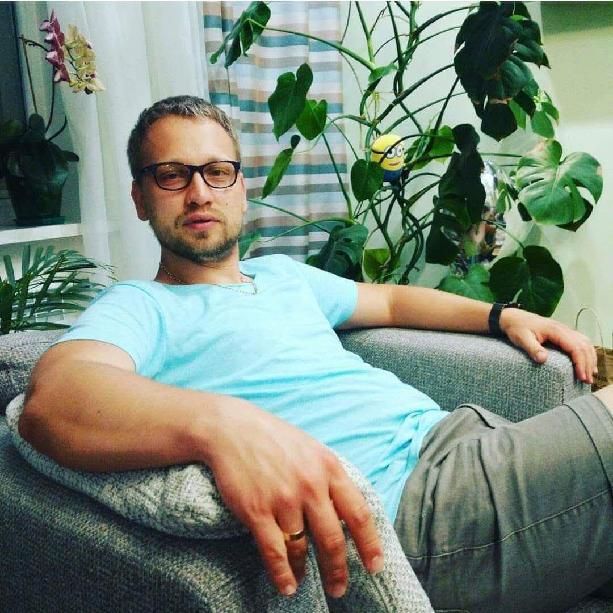

# **DMYTRO SYCHOV**

Telegram: [Mad_Pillow](https://t.me/Mad_Pillow) (primary contact) \| Mob: +380508736005 \| Email: [dmtr.schv@gmail.com](mailto:dmtr.schv@gmail.com) \| LinkedIn: [mad-pillow](http://www.linkedin.com/in/mad-pillow)

## **Professional Summary**

A highly reliable person with exceptional creativity, problem solving and interpersonal skills.

Consistently generate new ideas and concepts, capable of planning ahead, setting priorities, delegating, making decisions and influencing people.

**First place** holder of the Mariupol city Wide Scientific and Technical conference in 2001 in **"Programming"** category.

Able to fast and easy learning of new things. Have extreme passion for studying new programming languages and becoming an outstanding web developer. Got a lot of valuable skills from a previous experience.

## **Skills**

1. Soft skills

   - `Active learning`
   - `Ability to work in a team environment`
   - `Leadership`
   - `Creative problem solving`
   - `Expertise in troubleshooting`
   - `Critical thinking`

2. Tech skills

   - `HTML`
   - `CSS`
   - `SSAS / LESS`
   - `Pure JavaScript`
   - `React.js`
   - `Redux.js basics`
   - `BEM methodology`
   - `GIT`
   - `Github`

3. as well as additional technical skills
   - `AutoCAD, SOLIDWORKS confident user`
   - `Expert in 3D modelling and 3D Printing`
   - `Good mathematical skills`
   - `Competent in developing technical manuals and other documentation`

## **Coding experiene**

1. Tic-Tac-Toe game. React App with React Router. HTML, React, React Router, SASS. [Deploy](https://mad-pillow.github.io/tic-tac-toe/) / [Code](https://github.com/mad-pillow/tic-tac-toe/tree/development)
2. Todo-list application. React App. React. [Deploy](https://mad-pillow.github.io/todo-app/) / [Code](https://github.com/mad-pillow/todo-app/tree/development)
3. Portfolio Sample. Adaptive landing page. HTML, SASS, Pure JS, GULP. [Deploy](https://mad-pillow.github.io/online-portfolio-sample/) / [Code](https://github.com/mad-pillow/online-portfolio-sample)

## **Education**

I have not got any special programming education except short free online webinars so far. Self learning is what I do for developing. As I stated above I had got the first place at the Mariupol city wide scientific and technical conference in 2001 in category "Programming" as a result of self learning (Delphi).

| Time period | Institute                     | Faculty                     |
| :---------: | ----------------------------- | --------------------------- |
|  2021-2021  | RSSchool On-line Course       | **JavaScript**              |
|  2001-2006  | Odessa State Maritime Academy | Navigation                  |
|  1998-2001  | Mariupol City Liceum          | **Physics and mathematics** |

## **English**

**B1 Upper Intermediate** level proved by **[IELTS](https://www.ielts.org/)** Report. Oral and written communication
skills, along with superb reading comprehension. English practised wisely on the previous work places.

## **Moto**

_Nothing is impossible._
